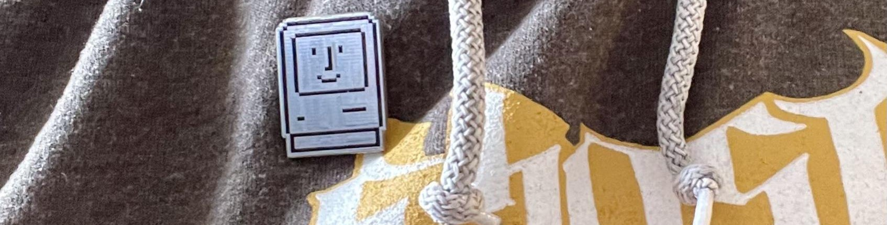

# Happy Mac 
It's a Happy Mac Lapel Pin! You can order some on JLPCB for as little as $4!

# Source
This little happy mac project is open source under a CC BY 4.0 license. You can download the gerbers and make happy macs for you and your friends. You can sell them too! Attribution is required.
 
 - [Gerbers](/gerbers/)
 - [Open Hardware](https://oshwlab.com/stephenarsenault/happy-mac) ([EasyEDA](https://easyeda.com/editor#id=602c9a76d2714835bba1bb6492230848))

#Ordering
When ordering from JLCPCB, make sure you order this with a white PCB so that the silkscreen is black. You could use ENIG instead of HASL for a fancy gold colored pin.

You will also want to order the pins, personally I elected to [use magnets like these from Amazon](https://www.amazon.com/gp/product/B07RWRVL39/).

